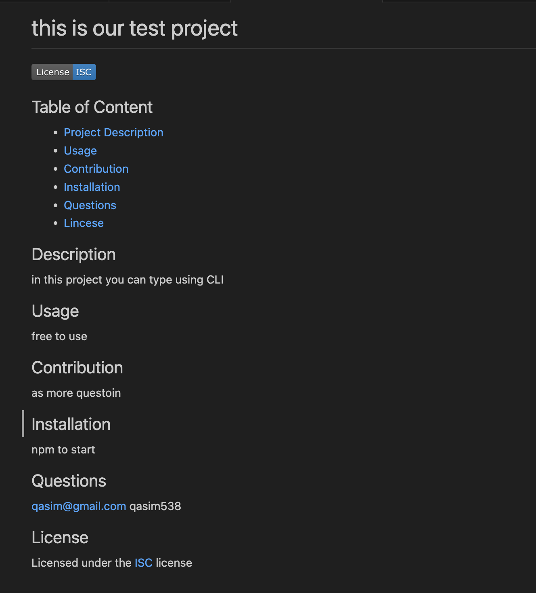

# Writing READEME.md from CLI
This is Command line based application to write a professional readme for any project 

## The Task
we had to come up with an app on CLI to write a professional README file
# User Story
I want to create a reuseable template so anyone can write a professional README.
 
I want to ask question on the command line and type answers
 
I want to show license badge and link to the license file

## Approach

I used inquirer dependency to ask questions. and then rendered links to the license pages 

## Responsiveness and Media Queries:
na

## Techenologies:
This is a JavaScrip project and all codes were written in .js file and run in command line.

## Deploy:
I deploy this website by using GitHub commands 
Git Clone, git add., git push.
And shared a live link for review.

## License:
I have added a MIT license. This is free website and anyone can use it.

## Links to Repository
Here is the link to repository:
https://github.com/Qasim538/README-Auto-Generator

## Links to Application
Here is the link to the online application:
https://github.com/Qasim538/README-Auto-Generator/

## Links to my Github
https://github.com/Qasim538

# Preview
A video added in the asset folder for review.

